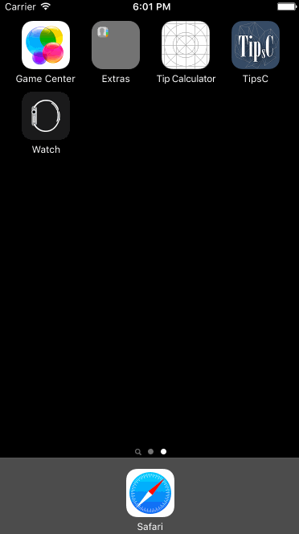

# Pre-work - *TipsC_Peini Wo*

**TipsC** is a tip calculator application for iOS.

Submitted by: **Peini Wo**

Time spent: **20** hours spent in total

## User Stories

The following **required** functionality is complete:
* [X] User can enter a bill amount, choose a tip percentage, and see the tip and total values.

The following **optional** features are implemented:
* [X] Custom font
* [ ] UI animations
* [X] Making sure the keyboard is always visible and the bill amount is always the first responder. This way the user doesn't have to tap anywhere to use this app. Just launch the app and start typing.

The following **additional** features are implemented:

- [X] List anything else that you can get done to improve the app functionality!

- A UISwitch for the user in case they need to split the bill
- A pickerview for the user to select how many people to split the bill
- Add App icon, launch image and image on navigation bar

## Video Walkthrough 

Here's a walkthrough of implemented user stories:

GIF created with [LiceCap](http://www.cockos.com/licecap/).

## Notes

Without any swift experience (only a 20-hour introduction class), I had to google and try everything after the video walkthrough.
It took time, but I had learned a lot and had a lot of fun.
I was trying to figure out how to make the shared average amount change while going back to change the tip percentages.
Sadly I couldn't spend more time on this before find out the solution.

The problem that I have is although I managed to figure out a way to make it work, I don't really know the meaning of each code I write.

## License

    Copyright [2016] [peiniwo]

    Licensed under the Apache License, Version 2.0 (the "License");
    you may not use this file except in compliance with the License.
    You may obtain a copy of the License at

        http://www.apache.org/licenses/LICENSE-2.0

    Unless required by applicable law or agreed to in writing, software
    distributed under the License is distributed on an "AS IS" BASIS,
    WITHOUT WARRANTIES OR CONDITIONS OF ANY KIND, either express or implied.
    See the License for the specific language governing permissions and
    limitations under the License.

